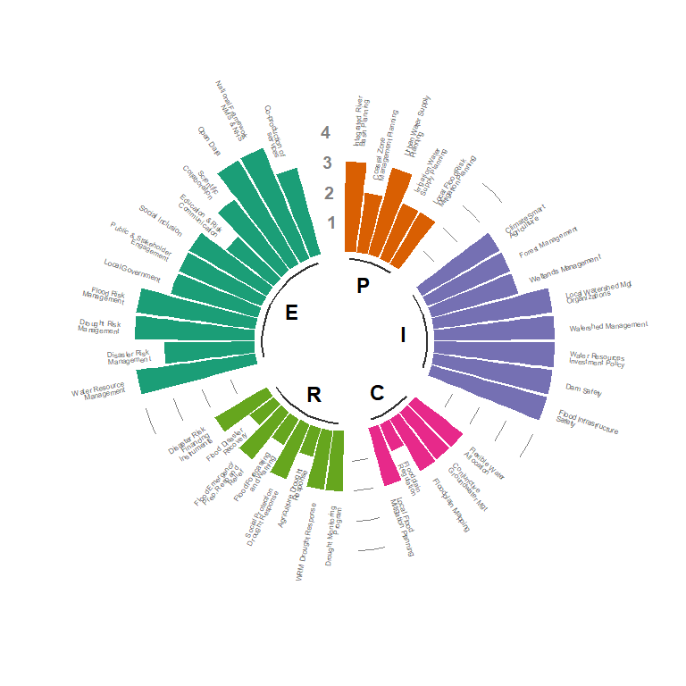

README
================

Repository to create a radial plot for the ERAM project.

## Basic usage

``` r
# Install requred R packages (if not already installed)
if(!require(scales)) {install.packages(scales)}
if(!require(ggplot2)) {install.packages(ggplot2)}
if(!require(dplyr)) {install.packages(dplyr)}
if(!require(readr)) {install.packages(readr)}

# R function to create the Radial plot
source("ERAMRadialPlot.R")

# Read-in tabular data from a csv file to create the visual
data <- readr::read_csv("sample_data.csv")

# Generate radial plot based on the data
p <- ERAMRadialPlot(data)

# Save plot to png  
ggplot2::ggsave(filename = "radialplot.png", plot = p, width = 8, height = 8)

# Save plot to pdf 
ggplot2::ggsave(filename = "radialplot.pdf", plot = p, width = 8, height = 8)
```

| group | sub                          | individual                      | value |
|:------|:-----------------------------|:--------------------------------|------:|
| E     | National Sectoral Frameworks | Water Resource Management       |     4 |
| E     | National Sectoral Frameworks | Disaster Risk Management        |     3 |
| E     | National Sectoral Frameworks | Drought Risk Management         |     4 |
| E     | National Sectoral Frameworks | Flood Risk Management           |     4 |
| E     | Whole-of-Society Approach    | Local Government                |     3 |
| E     | Whole-of-Society Approach    | Public & Stakeholder Engagement |     3 |

<!-- -->
